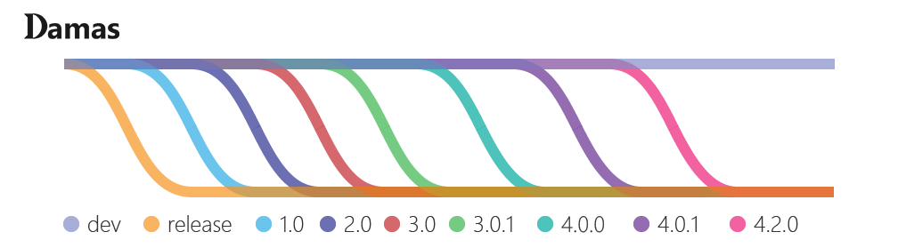

## 
 

    

## Overview
Damas scripting langage interpreter written in C++
- [Official Github Repository](https://github.com/Robot-Fromage/damas)
- [Damas Website](https://damas-lang.org/)
- [Documentation](https://damas-lang.org/documentation)
- [License](LICENSE.md)

## Workflow

    

The dev branch contains work in progress and may be unstable most of the time. We advise checking out the release branch to try and build the latest stable Damas version.

## Build and Documentation
Check the [documentation](https://damas-lang.org/documentation/) for the API reference and details on the build process.  

